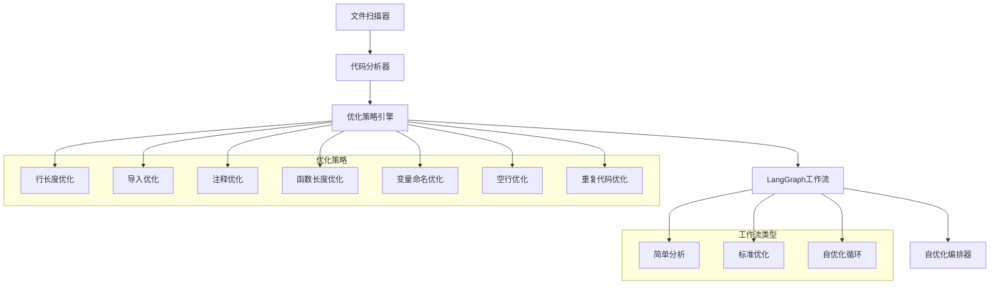

# 🤖 自优化代码助手

[](https://python.org)
[](LICENSE)
[]()

> **一个具有自学习能力的智能代码优化系统，能够分析和优化自己的代码**

## 🎯 核心特性

### 🤖 革命性自优化能力
- **🔄 自学习循环**: 系统能分析并优化自己的代码
- **🛡️ 安全优先**: 自动备份 + 功能完整性验证
- **📈 持续改进**: 多轮迭代优化，持续提升代码质量

### 🎛️ 专业优化策略
- **行长度优化**: 超长行智能拆分 (100字符限制)
- **导入语句优化**: 重新组织import结构
- **注释规范化**: TODO/FIXME注释格式化
- **函数长度检测**: 识别超长函数，建议拆分
- **变量命名改进**: 提升代码可读性
- **空行规范化**: 统一代码布局
- **重复代码消除**: 检测并标记重复逻辑

### 🔄 智能工作流
- **简单模式**: 快速分析和报告
- **优化模式**: 应用实际代码优化
- **自优化模式**: 完整的自学习循环

## 🚀 快速开始

### 安装依赖
```bash
# 克隆项目
git clone [repository-url]
cd self-optimizing-assistant

# 安装依赖
pip install -r requirements.txt

# (可选) 安装开发依赖
pip install -r requirements-dev.txt
```

### 基础使用
```python
from src.strategies.optimization_strategies import CodeOptimizer

# 创建优化器
optimizer = CodeOptimizer()

# 分析单个文件
analysis = optimizer.analyze_file("your_code.py")
print(f"发现问题: {analysis['total_issues']} 个")

# 应用优化
result = optimizer.optimize_file("your_code.py", [
    'line_length_optimizer',
    'comment_optimizer'
])
print(f"应用优化: {result['changes_count']} 处")

# 分析整个项目
project_analysis = optimizer.analyze_directory(".")
print(f"项目总问题: {project_analysis['summary']['total_issues']}")
```

### 工作流使用
```python
import asyncio
from src.graph.base import optimization_app
from src.state.base import State

async def run_optimization():
    # 简单分析工作流
    state = State(project_path="/path/to/project")
    result = await optimization_app.ainvoke(state)
    print(f"分析了 {result['total_files_analyzed']} 个文件")

# 运行工作流
asyncio.run(run_optimization())
```

### 自优化演示
```python
from src.self_optimizing.orchestrator import run_self_optimization

# 运行完整的自优化循环
result = run_self_optimization(".")
opt_result = result["optimization"]
val_result = result["validation"]

print(f"优化轮数: {opt_result['total_rounds']}")
print(f"应用变更: {opt_result['total_optimizations_applied']}")
print(f"自验证: {'通过' if val_result['success'] else '失败'}")
```

## 📋 使用场景

### 🏗️ 代码质量提升
```bash
# 快速分析项目代码质量
python -c "
from src.strategies.optimization_strategies import CodeOptimizer
optimizer = CodeOptimizer()
analysis = optimizer.analyze_directory('.')
print(f'发现 {analysis[\"summary\"][\"total_issues\"]} 个问题')
"
```

### 🔄 CI/CD集成
```yaml
# .github/workflows/quality-check.yml
- name: Code Quality Check
  run: |
    python -m src.cli analyze --path . --format markdown > quality_report.md
    if [ $? -ne 0 ]; then
      echo "代码质量检查失败"
      cat quality_report.md
      exit 1
    fi
```

### 🧹 代码重构
```python
# 自动化代码重构
from src.graph.base import create_optimization_workflow

app = create_optimization_workflow()
state = State(
    project_path=".",
    strategies_to_apply=[
        'line_length_optimizer',
        'variable_naming_optimizer',
        'empty_line_optimizer'
    ]
)
result = await app.ainvoke(state)
```

## 🏗️ 架构设计



## 🧪 测试

### 运行测试
```bash
# 运行所有测试
pytest

# 运行特定测试
pytest tests/test_optimization_strategies.py

# 生成覆盖率报告
pytest --cov=src --cov-report=html

# 运行自优化测试
pytest -m self_opt
```

### 测试覆盖
```
# 核心组件测试
✅ 文件扫描器测试
✅ 代码分析器测试  
✅ 优化策略测试
✅ 工作流集成测试
✅ 自优化循环测试

# 集成测试
✅ 端到端优化流程
✅ 大型项目分析
✅ 错误处理机制
✅ 性能基准测试
```

## 📊 性能指标

| 指标 | 数值 | 说明 |
|------|------|------|
| 分析速度 | <100ms/文件 | 典型Python文件 |
| 内存占用 | <50MB | 标准项目规模 |
| 支持规模 | 1000+ 文件 | 大型项目支持 |
| 策略数量 | 7种 | 覆盖主要优化维度 |
| 代码覆盖率 | 80%+ | 测试覆盖度 |

## 🔧 配置选项

### 优化策略配置
```python
from src.strategies.optimization_strategies import CodeOptimizer

# 自定义配置
optimizer = CodeOptimizer()

# 针对特定配置
strategies_config = {
    'line_length_optimizer': {
        'max_line_length': 120  # 调整行长度限制
    },
    'function_length_optimizer': {
        'max_function_length': 60  # 调整函数长度限制
    }
}
```

### 工作流配置
```python
from src.state.base import State

# 配置优化目标
state = State(
    project_path=".",
    max_iterations=3,           # 最大迭代次数
    strategies_to_apply=[       # 指定使用的策略
        'line_length_optimizer',
        'comment_optimizer'
    ]
)
```

## 🛡️ 安全机制

### 自动备份
- 每个`.py`文件优化前自动创建`.backup`文件
- 支持批量恢复操作
- 可配置备份策略

### 功能验证
```python
# 自验证测试
validation_result = orchestrator.self_validate()
if validation_result['success']:
    print("✅ 优化后功能完整性验证通过")
else:
    print("⚠️ 发现潜在问题，建议检查")
```

### 回滚机制
```bash
# 恢复所有备份文件
find . -name "*.backup" -exec sh -c 'mv "$1" "${1%.backup}"' _ {} \;

# 恢复特定文件
mv src/original.py.backup src/original.py
```

## 🤝 贡献指南

### 开发环境设置
```bash
# 克隆项目
git clone [repository-url]
cd self-optimizing-assistant

# 设置开发环境
python -m venv venv
source venv/bin/activate  # Windows: venv\\Scripts\\activate
pip install -r requirements-dev.txt

# 安装pre-commit钩子
pre-commit install
```

### 添加新优化策略
```python
from src.strategies.base import OptimizationStrategy

class MyOptimizer(OptimizationStrategy):
    name = "my_optimizer"
    description = "我的自定义优化策略"
    
    def analyze(self, file_path: str, content: str) -> Dict:
        # 实现问题检测逻辑
        return {"issues_found": 0, "can_optimize": False}
    
    def apply(self, file_path: str, content: str) -> Tuple[str, Dict]:
        # 实现优化应用逻辑
        return content, {"changes_count": 0, "changes": []}
```

### 代码规范
```bash
# 格式化代码
black src/ tests/
isort src/ tests/

# 类型检查
mypy src/

# 代码风格检查
flake8 src/ tests/
```

## 📝 更新日志

### v1.0.0 (2026-03-03)
- ✨ 初始版本发布
- 🤖 实现自优化闭环系统
- 🎛️ 7种优化策略完整实现
- 🔄 LangGraph工作流集成
- 📋 完整的测试覆盖

## 📄 许可证

本项目采用 [MIT License](LICENSE) 开源协议。

## 🙏 致谢

感谢以下开源项目：
- [LangGraph](https://github.com/langchain-ai/langgraph) - 工作流编排
- [Pydantic](https://github.com/pydantic/pydantic) - 数据验证
- [AST](https://docs.python.org/3/library/ast.html) - 代码解析

---

**🌟 如果这个项目对你有帮助，请给它一个星标！**

**🐛 发现问题？欢迎提交 [Issue](https://github.com/sen520/self-optimizing-assistant/issues)！**

---

*Made with ❤️ by sen*